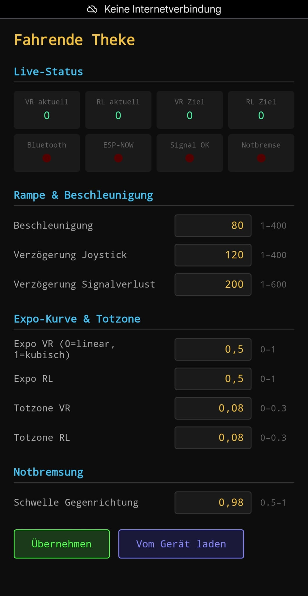

# Fahrende Theke — ESP32 Motorsteuerung per Fernbedienung

ESP-NOW-basierte Funk-Fernsteuerung für einen Elektromotor, entwickelt für die "Theke".

## Projektübersicht

Zwei ESP32-Boards kommunizieren über ESP-NOW (kein Router nötig):

- **Sender**: Liest zwei Joysticks (VR = vor/zurück, RL = links/rechts) und einen Geschwindigkeits-Poti. Sendet alle 50ms ein Paket an den Receiver.
- **Receiver**: Empfängt die Joystick-Werte, verarbeitet sie und gibt Steuerbefehle an einen nachgelagerten PID-Motorregler aus (über Serial, 9600 Baud). Alternativ kann ein Xbox-Controller per Bluetooth (Bluepad32) direkt am Receiver verwendet werden — der BT-Controller hat dabei Vorrang vor ESP-NOW.

### Funktionen

- **Expo-Kurve**: Nicht-linearer Joystick-Response — kleine Ausschläge reagieren sanft, voller Ausschlag gibt vollen Wert
- **Totzone (Deadzone)**: Eingaben unter einem konfigurierbaren Schwellwert werden als 0 behandelt — verhindert Drift bei losgelassenem Stick
- **Hysterese (RL)**: Die RL-Deadzone verwendet eine Hysterese (130%/100%) um Flackern an der Grenze zu verhindern
- **Beschleunigungs-/Verzögerungs-Ramp**: VR-Werte ändern sich schrittweise, RL reagiert direkt (Lenken)
- **Signalverlust-Failsafe**: Kein Paket seit 300ms → Motor bremst kontrolliert auf 0
- **Notbremsung**: Joystick ≥98% in Gegenrichtung → sofortiger Stopp, Wiederfahrt erst nach Neutralstellung
- **MAC-Lock**: Receiver akzeptiert nur den ersten Sender der sich meldet, ignoriert andere (Timeout: 300ms)
- **Weboberfläche**: Alle Parameter live einstellbar über `192.168.4.1` (WLAN: `FahrendeTheke` / `fahrende123`)

### Pinbelegung

**Sender:**
| Pin | Funktion |
|-----|----------|
| GPIO35 | Joystick VR (vor/zurück) |
| GPIO34 | Joystick RL (links/rechts) |
| GPIO32 | Geschwindigkeit (Poti) |
| GPIO33 | Hupe (Button) |

**Receiver:**
| Pin | Funktion |
|-----|----------|
| GPIO5 | Hupe (LED/Summer) |
| TX0 | Serieller Output an PID-Regler |

### Serielle Ausgabe (Receiver)

```
VR:-1842    <- vor/zurück (-2047 bis +2047)
RL:+650     <- rechts/links (-1300 bis +1300)
```

### Weboberfläche (Receiver)

Der Receiver öffnet beim Start immer einen WLAN-Access-Point:

| Parameter | Standard |
|-----------|----------|
| SSID | `FahrendeTheke` |
| Passwort | `fahrende123` |
| IP | `192.168.4.1` |



Über die Weboberfläche einstellbar (live, ohne Neustart):

| Parameter | Beschreibung | Standard |
|-----------|-------------|---------|
| `accelStep` | Beschleunigungsschrittweite (VR) | 80 |
| `decelStep` | Verzögerungsschrittweite Joystick (VR) | 120 |
| `signalLossDecelStep` | Verzögerung bei Signalverlust | 200 |
| `expoVR` / `expoRL` | Expo-Kurve (0=linear, 1=kubisch) | 0.5 |
| `deadzoneVR` / `deadzoneRL` | Totzone (Anteil am Maximalwert) | 0.08 |
| `emergencyThreshold` | Schwelle Gegenrichtungs-Notbremse | 0.98 |

---

## Entwicklungsumgebung

Das Projekt nutzt **PlatformIO** (VS Code Extension) mit dem [pioarduino](https://github.com/pioarduino/platform-espressif32) Platform-Fork für ESP32 Arduino Core 3.x (ESP-IDF 5.4).

### Voraussetzungen

- VS Code mit PlatformIO Extension
- Kein separater Arduino-Core nötig — PlatformIO lädt alles automatisch

### Bauen und Flashen

```bash
# Sender bauen und flashen
pio run -e sender --target upload

# Receiver bauen und flashen
pio run -e receiver --target upload

# Nur bauen (ohne Upload)
pio run -e sender
pio run -e receiver
```

### MAC-Adresse auslesen

Vor dem ersten Einsatz die MAC-Adresse des Receiver-Boards auslesen und in `src/sender/main.cpp` eintragen:

```bash
# tools/get_mac auf den Receiver flashen
# MAC wird im Serial Monitor ausgegeben (115200 Baud)
# Dann broadcastAddress in src/sender/main.cpp anpassen
```

---

## Bluepad32 (PlatformIO)

Bluepad32 ermöglicht die Verbindung eines Xbox-Controllers per Bluetooth direkt auf dem Receiver-ESP32, parallel zu ESP-NOW.

Der Receiver verwendet ein **custom-gebautes Framework-Paket** mit Bluepad32 v4.2.0 auf Arduino-ESP32 Core 3.x / ESP-IDF 5.4. Dieses löst das Koexistenz-Problem zwischen BTstack (Bluepad32) und ESP-NOW, das in Core 2.x auftrat.

Das Paket ist in `platformio.ini` eingebunden:

```ini
[env:receiver]
platform = https://github.com/pioarduino/platform-espressif32/releases/download/55.03.37/platform-espressif32.zip
platform_packages =
    framework-arduinoespressif32@https://github.com/gelir95/esp32-arduino-lib-builder/releases/download/bluepad32-v4.2.0/esp32-bluepad32-4.2.0.3.1.0.zip
    framework-arduinoespressif32-libs@https://github.com/gelir95/esp32-arduino-lib-builder/releases/download/bluepad32-v4.2.0/bluepad32-framework-libs.zip
```

### Framework neu bauen (bei Bluepad32-Update)

Build-Anleitung: [gelir95/esp32-arduino-lib-builder — Bluepad32 Branch](https://github.com/gelir95/esp32-arduino-lib-builder/tree/bluepad32)

---

## Xbox Controller verbinden

### Unterstützte Controller
- Xbox One (Modell 1708 und neuer) mit Bluetooth
- Xbox Series X/S

### Pairing
1. Controller einschalten (Xbox-Taste)
2. **Pairing-Taste** (kleine runde Taste oben) **3 Sekunden** gedrückt halten
3. Xbox-Logo blinkt schnell → Pairing-Modus aktiv

Bluepad32 verbindet sich beim ersten Start automatisch mit dem ersten gefundenen Controller. Nach dem ersten Pairing wird der Controller beim nächsten Einschalten automatisch wiederverbunden.
